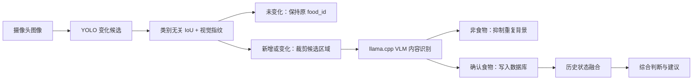

# 智能冰箱混合识别链路

## 目标

智能冰箱当前采用 YOLO 变化定位与 VLM 内容识别的混合方案。YOLO 负责快速、低成本地发现画面变化并生成候选区域，不决定里面是什么；VLM 主识别服务通过 `llama.cpp` 负责最终语义识别、状态评估与数据库写入。最终建议不只依赖单帧图片，而是结合数据库中同一食物 ID 的历史内容、最新状态、存放时长与规则层判断。

## 总体流程



## 模块职责

### YOLO 变化定位

YOLO 只负责变化候选与区域定位，不承担食物身份或状态判断。

- 输出候选框坐标、检测置信度、调试类别和时间戳。
- 使用类别无关的框重叠与视觉指纹判断候选区域是否发生变化。
- 未变化对象维持原 `food_id`；新增或明显变化的区域才触发 VLM。
- YOLO 类别和置信度只作为路由及排错元数据，不作为内容识别证据。
- 不直接写最终食物名称、保鲜状态或食用建议。

### llama/VLM 主识别

VLM 是主识别模块，运行在 `llama.cpp` 的 OpenAI-compatible 接口上。工程实现中，数据库写入由调用 `llama-server` 的主识别服务完成，不让模型进程直接连接数据库。

- 根据候选区域的图像像素独立判断是否为食物，并识别标准食物名称。
- 评估食物可见状态，例如新鲜、轻微变质、明显变质、包装破损、疑似过期。
- 输出结构化结果，包含食物名称、状态、置信度、观察描述和建议标签。
- 根据变化匹配结果决定新增食物记录，或维持已有食物 ID。
- 通过主识别服务将 VLM 结构化结果写入数据库。
- 使用 llama-server JSON Schema 约束字段类型和枚举，客户端再次校验名称与枚举值；不合法结果按推理失败处理，不写数据库。

### 数据库与融合层

数据库不是简单日志，而是智能冰箱最终判断的事实来源。

- 每个食物实体拥有稳定 `food_id`。
- 每次经 VLM 确认的内容识别生成一条 observation，保留图片时间、YOLO 候选和 VLM 判断；未变化帧不重复写 observation。
- 同一 `food_id` 的历史状态、最新状态、入库时间、保质期和用户操作一起参与判断。
- 最终建议由融合层产生，而不是由 YOLO 或单次 VLM 输出单独决定。

## 建议数据边界

后续实现数据库时，至少保留以下三类数据。

```text
foods
  food_id
  canonical_name
  first_seen_at
  last_seen_at
  storage_location
  status_current
  advice_current

food_observations
  observation_id
  food_id
  captured_at
  yolo_label
  yolo_confidence
  yolo_bbox
  vlm_name
  vlm_state
  vlm_confidence
  vlm_description
  image_ref

food_events
  event_id
  food_id
  event_type
  event_at
  source
  payload_json
```

## 重复判断原则

重复判断基于候选区域的位置与视觉内容，不依赖 YOLO 类别。

- 位置接近、框重叠高且视觉指纹差异在阈值内的结果标为同一候选。
- 已存在 `food_id` 且最新观察时间接近时，优先更新 observation，不新建 food。
- YOLO 类别变化但图像内容未变时保留原 `food_id`，身份仍以 VLM 和数据库历史为准。
- 同一位置的视觉内容明显变化时重新触发 VLM，不因框位置相同而直接判重。
- 对低置信度、遮挡严重或多物体堆叠场景，保留人工确认入口。

## 综合建议原则

最终建议使用多源信息融合。

- 视觉状态：VLM 对颜色、形态、包装、霉斑、腐烂迹象的判断。
- 时间状态：入库时间、最近识别时间、保质期或用户录入日期。
- 历史变化：同一 `food_id` 过去多次 observation 的状态趋势。
- 规则状态：冷藏/冷冻位置、温湿度传感器、用户自定义阈值。

建议输出应分为稳定状态，例如：

- `normal`：可正常保存或食用。
- `attention`：建议尽快食用、检查包装或确认日期。
- `danger`：疑似变质、过期或不建议食用。

## 当前落地策略

- 板端继续保持 YOLO ONNX Runtime CPU 推理，用于变化候选和区域生成。
- VLM 继续保持 `llama.cpp` CPU runtime，当前使用智能冰箱 Qwen2.5-VL GGUF 模型。
- SQLite 主库已落地到 `~/smart-fridge/data/fridge.sqlite3`，通过 `fridge_db.py` 维护 `foods`、`food_observations` 和 `food_events`。
- 自动识别管线已落地到 `fridge_pipeline.py`：默认每 1 小时拍照一次，最多保留 24 张临时拍照图，YOLO 候选使用类别无关 IoU 与 64 位视觉指纹匹配，新增或变化区域裁剪后送入 VLM，移除目标写入 `food.removed` 事件。
- VLM 超时或失败时默认不写入食物数据库，候选在下一轮重新分析；VLM 判定为非食物的未变化背景会被抑制。
- OpenCL runtime 只作为实验结果保留，不参与默认链路。
- 中文 Web 面板已展示当前库存、环境、变化记录和综合建议。
