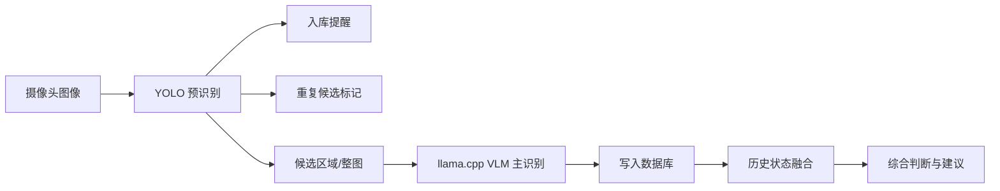

# 智能冰箱混合识别链路

## 目标

智能冰箱当前采用 YOLO 预识别与 VLM 主识别的混合方案。YOLO 负责快速、低成本地发现候选食物目标，VLM 主识别服务通过 `llama.cpp` 负责最终语义识别、状态评估与数据库写入。最终建议不只依赖单帧图片，而是结合数据库中同一食物 ID 的历史内容、最新状态、存放时长与规则层判断。

## 总体流程



## 模块职责

### YOLO 预识别

YOLO 只负责入口级目标检测，不承担最终食物状态判断。

- 输出候选食物类别、置信度、框坐标和时间戳。
- 根据连续帧或最近检测结果产生入库提醒。
- 标记疑似重复目标，避免同一食物在短时间内重复入库。
- 为 VLM 提供候选区域、候选标签和触发依据。
- 不直接写最终食物名称、保鲜状态或食用建议。

### llama/VLM 主识别

VLM 是主识别模块，运行在 `llama.cpp` 的 OpenAI-compatible 接口上。工程实现中，数据库写入由调用 `llama-server` 的主识别服务完成，不让模型进程直接连接数据库。

- 根据整图、YOLO 候选区域和提示词识别标准食物名称。
- 评估食物可见状态，例如新鲜、轻微变质、明显变质、包装破损、疑似过期。
- 输出结构化结果，包含食物名称、状态、置信度、观察描述和建议标签。
- 根据重复候选结果决定新增食物记录，或更新已有食物 ID 的最新观察。
- 通过主识别服务将 VLM 结构化结果写入数据库。

### 数据库与融合层

数据库不是简单日志，而是智能冰箱最终判断的事实来源。

- 每个食物实体拥有稳定 `food_id`。
- 每次视觉识别都生成一条 observation，保留图片时间、YOLO 候选和 VLM 判断。
- 同一 `food_id` 的历史状态、最新状态、入库时间、保质期和用户操作一起参与判断。
- 最终建议由融合层产生，而不是由 YOLO 或单次 VLM 输出单独决定。

## 建议数据边界

后续实现数据库时，至少保留以下三类数据。

```text
foods
  food_id
  canonical_name
  first_seen_at
  last_seen_at
  storage_location
  status_current
  advice_current

food_observations
  observation_id
  food_id
  captured_at
  yolo_label
  yolo_confidence
  yolo_bbox
  vlm_name
  vlm_state
  vlm_confidence
  vlm_description
  image_ref

food_events
  event_id
  food_id
  event_type
  event_at
  source
  payload_json
```

## 重复判断原则

重复标记先由 YOLO 提供候选，再由融合层结合数据库确认。

- 短时间内同类别、位置接近、框重叠高的检测结果默认标为同一候选。
- 已存在 `food_id` 且最新观察时间接近时，优先更新 observation，不新建 food。
- YOLO 类别不稳定时，以 VLM 的标准食物名称和数据库历史为准。
- 对低置信度、遮挡严重或多物体堆叠场景，保留人工确认入口。

## 综合建议原则

最终建议使用多源信息融合。

- 视觉状态：VLM 对颜色、形态、包装、霉斑、腐烂迹象的判断。
- 时间状态：入库时间、最近识别时间、保质期或用户录入日期。
- 历史变化：同一 `food_id` 过去多次 observation 的状态趋势。
- 规则状态：冷藏/冷冻位置、温湿度传感器、用户自定义阈值。

建议输出应分为稳定状态，例如：

- `normal`：可正常保存或食用。
- `attention`：建议尽快食用、检查包装或确认日期。
- `danger`：疑似变质、过期或不建议食用。

## 当前落地策略

- 板端继续保持 YOLO ONNX Runtime CPU 推理，用于入口检测和候选生成。
- VLM 继续保持 `llama.cpp` CPU runtime，当前使用智能冰箱 Qwen2.5-VL GGUF 模型。
- SQLite 主库已落地到 `~/smart-fridge/data/fridge.sqlite3`，通过 `fridge_db.py` 维护 `foods`、`food_observations` 和 `food_events`。
- OpenCL runtime 只作为实验结果保留，不参与默认链路。
- 下一步应优先实现一个轻量服务层，调用 YOLO 与 VLM 后使用 `fridge_db.py ingest` 写入 SQLite，再补 Web UI 或接口展示。
